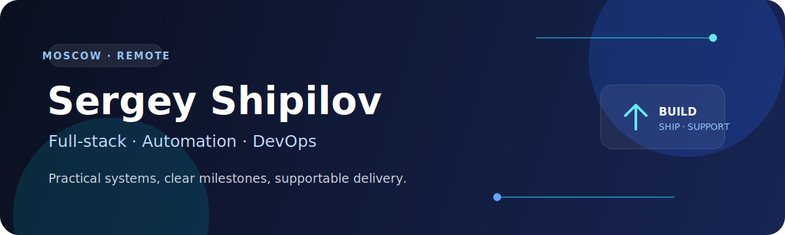

I build practical software for teams that need a result, not a permanent experiment: web applications connected to real APIs, workflow automation, Telegram/Python tools and dependable deployments.

Based in **Moscow** and available for remote contract work. Native Russian; comfortable with written English and async collaboration.

### What I can ship

- **Web products:** Next.js, React, TypeScript, Node.js and REST APIs
- **Automation:** Python, public-data workflows, reports and Telegram bots
- **Backend & security:** Express, MongoDB/SQL, JWT, validation, RBAC and audit-friendly flows
- **Delivery:** Linux, Docker, VPS, Nginx, Git-based CI/CD and deployment troubleshooting

### Featured work

<table>
  <tr>
    <td width="58%">
      <h3><a href="https://github.com/merrrn1/secure-dashboard-foundation">Secure Dashboard Foundation</a></h3>
      
A production-minded Next.js + Express foundation with MongoDB, JWT authentication, validation, tests and Docker.

      
<strong>Why it exists:</strong> to show how I turn a static interface into a supportable full-stack system with documented trade-offs and a repeatable local setup.

    </td>
    <td width="42%">
      
    </td>
  </tr>
</table>

### How I work

1. Define one concrete deliverable and the acceptance check.
2. Deliver a small working milestone early.
3. Keep secrets outside the repository and document setup/rollback.
4. Leave source code and a short handover that another engineer can follow.

### Toolkit

### Contact

For a project, send the current problem, the expected result and any error/log excerpt with secrets removed.

I do not accept work involving seed phrases, account takeovers, payment-card abuse or bypassing access controls.
